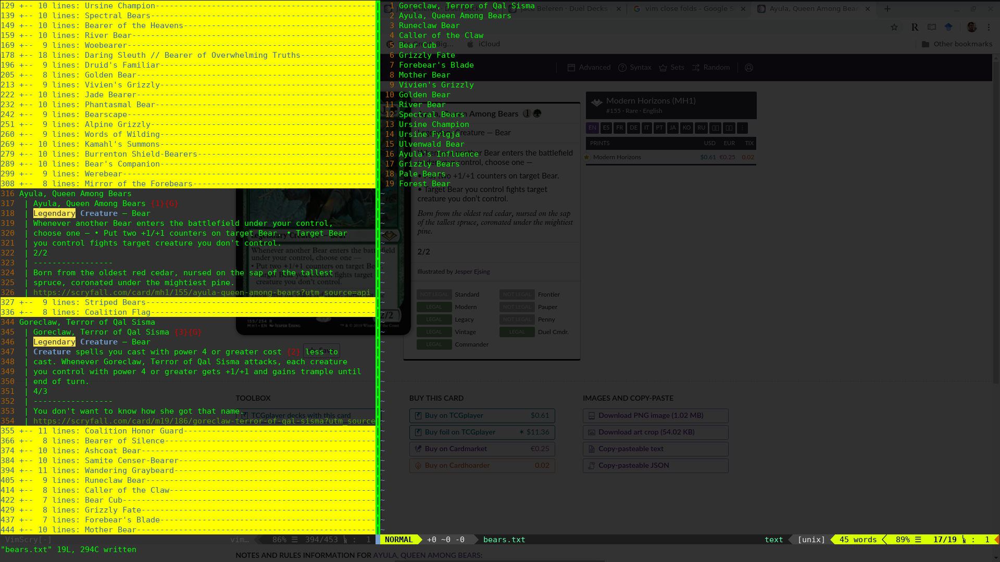

# VimScry

A Magic the Gathering plugin for vim.

VimScry combines the power of Vim with the utility of Scryfall.

# Installation

[vim-plug](https://github.com/junegunn/vim-plug)

Add 
`Plug 'TarkanAl-Kazily/vimscry'`
in your vimrc.

# Usage

This plugin adds the `:Scry` command to query the Scryfall database. In order
to minimize the number of API calls it makes, it will fetch the bulk card
database if the current cache is out of date once the first time you use the
Scry command, and then makes searches through the returned data, caching
it for offline use. Results are displayed in a vimscry buffer using standard
Vim folding, allowing you to expand card names to read their full Oracle text.

By pressing enter with your cursor over a card in the vimscry window, the
scryfall page for that card will open in your browser.

By pressing tab with your cursor over a range of cards, you will copy over
each card's name into your main buffer.

Pressing Y with your cursor over one or more cards adds those cards names
to your clipboard.

Additionally, the `:RandomCard` command will return a random card for your
reading pleasure.
